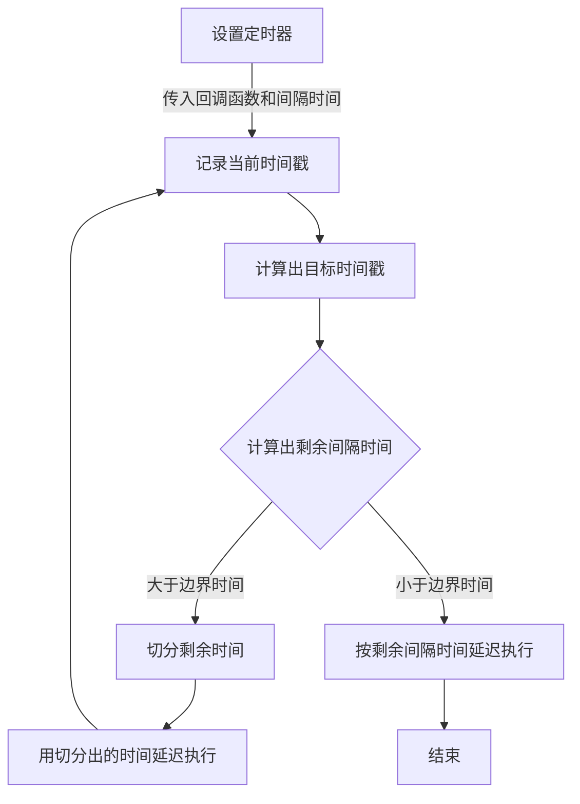
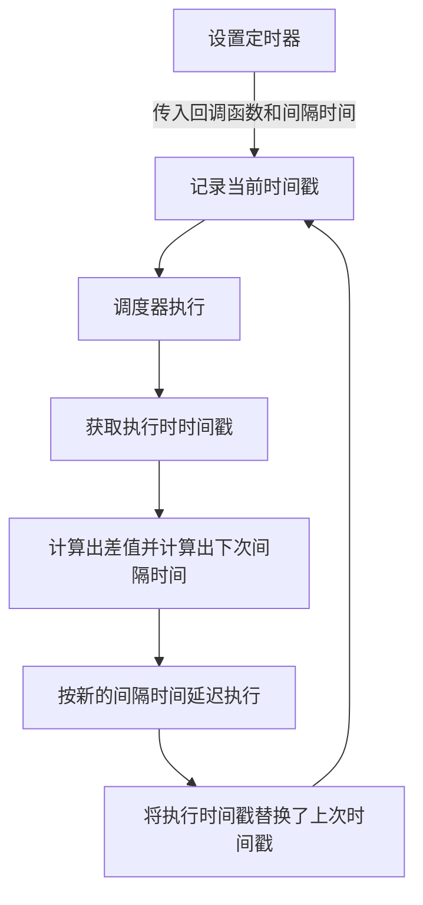

# 不准确的定时器

### 什么是定时器

javascript 的 globalThis 中，分别有三个 api：`setTimeout`、`setInterval`、`setImmediate`，他们都是定时器的一种，意思是允许在某个时刻开始执行，尽管他们看上去很相似，不过其实各不相同，甚至在不同运行环境也各自不同。

- setTimeout：用于设置一个定时器，在到期后执行一个函数。
- setInterval：用于设置一个轮训定时器，重复调用一个函数并在每次调用之间具有固定间隔。
- setImmediate：用于设置一个立刻执行器，在当前事件轮询中任何 i/o 操作后，在任何下一轮定时器开始前执行。

### 用法

- setTimeout 和 setInterval 语法相当

```javascript
var timeoutID = setTimeout(function[, delay, arg1, arg2, ...]);
var timeoutID = setTimeout(code[, delay, arg1, arg2, ...]);

var intervalID = setInterval(function[, delay, arg1, arg2, ...]);
var intervalID = setInterval(code[, delay, arg1, arg2, ...]);
```

第一个参数为回调函数，在 `WindowOrWorkerGlobalScope`下可以为**脚本字符串**（node 中不支持），如果为字符串则会被类似 eval()调用，非常不推荐。
第二个参数为`可选`的延迟毫秒数（1 秒为 1000 毫秒），如果省略该参数则默认为 0。
第三个往后的参数为`可选`的附加参数，会被作为参数传入 function 中。

- setImmidate 语法

```javascript
var immediateID = setImmediate(function[, arg1, arg2, ...]);
```

这里除了没延迟毫秒数外与 setTimeout 和 setInterval 差不多。此 api 在浏览器环境为非标准 api，尽量不在浏览器环境中使用。该 api 受到了 Gecko 和 Webkit 的阻力，可能未来也不会被纳入标准中。

可以通过 `MessageChannel` 或者 `postMessage` 来模拟一个 setImmediate。**本篇文章不着重讲此 api**。

### 不准确是怎么回事

有很多因素会导致定时器的回调函数执行比设定的预期值更久，下面会分别讲解：

#### 最小间隔 4ms

在 HTML5 规范中，setTimeout 和 setInterval 被设定为最小间隔为 `4ms`（在[HTML5 spec](https://html.spec.whatwg.org/multipage/timers-and-user-prompts.html#timers)中被精确），这种通常是因为被函数阻塞或者函数嵌套级别到了一定深度导致的。例如：

```javascript
function cb() {
  f();
  setTimeout(cb, 0);
}
setTimeout(cb, 0);
// 或
setInterval(f, 0);
```

在 Chrome 和 Firefox 中，定时器的第五次会被阻塞，Safari 是第六次，Edge 在第三次。

而最小延时，由`DOM_MIN_TIMEOUT_VALUE`（Firefox 在`dom.min_timeout_value`）这个变量控制，而 node 为了与浏览器行为对齐，设置了最低[1ms 的间隔](https://github.com/nodejs/node/blob/v8.9.4/lib/timers.js#L456)。

所以如果测试一下 setTimeout 递归 60 次（模拟 60 秒），电脑为 MacBook Pro (13-inch, 2019, Four Thunderbolt 3 ports)：

```javascript
(() => {
  let n2 = 0;
  const tick2 = () => {
    setTimeout(() => {
      n2++;
      if (n2 === 60) {
        console.timeEnd('setTimeout');
      } else {
        tick2();
      }
    }, 1000);
  };
  console.time('setTimeout');
  tick2();
})();
```

在`chrome85`中时间为：


总共是有 155ms 的延迟。

在`node v12.18.3`中时间为：


总共是有 163ms 的延迟。

#### 未被激的会话窗最小延迟 1000ms

这是浏览器为了优化后台 tab 的加载损耗（或者说降低耗电量），对不在前台的会话窗最小延迟限制为 1000ms

我们可以继续测试一下上面的代码，全程把页面放入后台中，在`chrome85`中时间为：


总共是有 39396ms(39s) 的延迟。

#### 最大间隔为 2147483647ms

这个就不测试了，很简单就是 `2^31 - 1`毫秒，因为浏览器内部以 32 位整数存储延时，这样会导致定时器立刻执行。

### 解决延迟

**讲道理这个很难**，因为作为一个单线程语言，可能会在任何时间内被阻塞，按道理无法保证其时间准确性。

#### requestTimeout

但是可以用一些自动或者动态修正的方法去减少误差，我们可以先实现一个 requestTimeout，先做个流程图



这样其实也只能将间隔时间缩得足够小，每一次切分其实都是重新拿时间戳去对照了。

代码实现：

```javascript
const { requestTimeout, cancelTimeout } = (() => {
  // 建立的任务表
  const cacheMap = new Map();
  // 获取当前相对时间戳
  const getNow =
    typeof process !== 'undefined'
      ? () => process.uptime() * 1000
      : () => new Event('').timeStamp;
  const RATIO = 0.1; // 拆解timer时间系数
  const EDGE = 10; // 边界值
  let id = 0;

  /**
   * 请求延迟回调
   * @param {Function} fn 回调函数
   * @param {number} delay 延迟时间
   * @param {boolean} isBlock 是否使用阻塞
   * @returns {number} id
   */
  const requestTimeout = (fn, delay = 0, isBlock = false) => {
    id++;
    cacheMap.set(id, { pause: false });
    // 获取是否允许继续
    const getAllowContinue = () => !cacheMap.get(id).pause;
    // 上一次调度器执行的时间戳
    let previousTimeStamp = getNow();
    // 目标时间戳
    const targetTimestamp = previousTimeStamp + delay;

    // 调度器
    const requestScheduler = isBlock
      ? () => {
          if (getAllowContinue()) {
            // 阻塞
            while (
              getNow() - previousTimeStamp < delay &&
              getAllowContinue()
            ) {}
            fn();
          }
        }
      : () => {
          if (getAllowContinue()) {
            previousTimeStamp = getNow();
            // 获取剩余延迟时间
            const restDelay = targetTimestamp - previousTimeStamp;
            // 判断是否剩余小于边界值的时间
            const nearTheEdge = restDelay <= EDGE;
            setTimeout(
              () => {
                nearTheEdge ? fn() : requestScheduler();
              },
              nearTheEdge ? restDelay : restDelay * RATIO
            );
          }
        };

    requestScheduler();
    return id;
  };

  /**
   * 取消延迟任务
   * @param {number} id 任务id
   * @returns {void}
   */
  const cancelTimeout = id => {
    if (cacheMap.has(id)) {
      const cache = cacheMap.get(id);
      cache.pause = true;
    }
  };

  return {
    requestTimeout,
    cancelTimeout,
  };
})();
```

这里实际上还用了阻塞去做延迟执行，这样子更精准点但是会阻塞线程。

下面可以测试一下执行精度：

- 浏览器前台：

  

- 浏览器后台：

  

- node：

  

requestTimeout 在后台递归的时候表现更差了，这是因为本身就被浏览器延迟了，但是单次执行的准确度还是比 setTimeout 高的。

- setTimeout 单次：

  

- requestTimeout 单次：

  

#### requestInterval

interval 倒是完全可以减少误差的，办法就是每次都获取上一次的真实间隔时间，然后再动态更改下一次的延迟即可。根据这个想法做个流程图：



延迟执行可以利用上面实现的 requestTimeout，按流程图实现代码：

```javascript
const { requestInterval, cancelInterval } = (() => {
  // 建立的任务表
  const cacheMap = new Map();
  // 获取当前相对时间戳
  const getNow =
    typeof process !== 'undefined'
      ? () => process.uptime() * 1000
      : () => new Event('').timeStamp;
  let id = 0;

  /**
   * 请求间隔调用
   * @param {Function} fn 回调函数
   * @param {number} interval 间隔时间
   * @returns {number} id
   */
  const requestInterval = (fn, interval = 0) => {
    id++;
    cacheMap.set(id, { pause: false });
    // 上一调度器执行时间戳
    let previousTimeStamp = getNow();
    // 获取是否允许继续
    const getAllowContinue = () => !cacheMap.get(id).pause;

    // 调度器
    const requestScheduler = (currentInterval = interval) => {
      if (getAllowContinue()) {
        requestTimeout(() => {
          const currentTimeStamp = getNow(); // 当前时间戳
          const realInterval = currentTimeStamp - previousTimeStamp; // 本次和上次的真实间隔
          const delta = interval + (interval - realInterval); // 间隔差值
          const nextInterval = delta > 0 ? delta : 0; // 下一次间隔时间
          const skipTimes = Math.floor((realInterval - interval) / interval); // 被跳过的次数（被阻塞或者睡眠）
          previousTimeStamp = currentTimeStamp;
          fn(skipTimes > 0 ? skipTimes : 0);
          requestScheduler(nextInterval);
        }, currentInterval);
      }
    };

    requestScheduler();
    return id;
  };

  /**
   * 取消间隔任务
   * @param {number} id 任务id
   * @returns {void}
   */
  const cancelInterval = id => {
    if (cacheMap.has(id)) {
      const cache = cacheMap.get(id);
      cache.pause = true;
    }
  };

  return {
    requestInterval,
    cancelInterval,
  };
})();
```

### 测试结果对比

测试代码为

```javascript
/**
 * 60次requestTimeout递归测试
 */
(() => {
  let n1 = 0;
  const tick1 = () => {
    requestTimeout(() => {
      n1++;
      if (n1 >= 60) {
        console.timeEnd('60 times requestTimeout');
      } else {
        tick1();
      }
    }, 1000);
  };
  console.time('60 times requestTimeout');
  tick1();
})();

/**
 * setTimeout测试对照组
 */
(() => {
  let n2 = 0;
  const tick2 = () => {
    setTimeout(() => {
      n2++;
      if (n2 === 60) {
        console.timeEnd('setTimeout');
      } else {
        tick2();
      }
    }, 1000);
  };
  console.time('setTimeout');
  tick2();
})();

/**
 * setInterval测试对照组
 */
(() => {
  console.time('setInterval');
  let n3 = 0;
  const timer1 = setInterval(() => {
    n3++;
    if (n3 === 60) {
      console.timeEnd('setInterval');
      clearInterval(timer1);
    }
  }, 1000);
})();

/**
 * requestInterval测试对照组1
 */
(() => {
  console.time('requestInterval1');
  let n4 = 0;
  const timer2 = requestInterval(() => {
    n4++;
    if (n4 === 60) {
      console.timeEnd('requestInterval1');
      cancelInterval(timer2);
    }
  }, 1000);
})();

/**
 * requestInterval测试对照组2
 */
(() => {
  console.time('requestInterval2');
  let n5 = 0;
  const timer3 = requestInterval(() => {
    n5++;
    if (n5 === 60) {
      console.timeEnd('requestInterval2');
      cancelInterval(timer3);
    }
  }, 1000);
})();

/**
 * requestInterval测试对照组3
 */
(() => {
  console.time('requestInterval3');
  let n6 = 0;
  const timer4 = requestInterval(() => {
    n6++;
    if (n6 === 60) {
      console.timeEnd('requestInterval3');
      cancelInterval(timer4);
    }
  }, 1000);
})();
```

- 浏览器前台：

  

- 浏览器后台：

  

- node：

  

### 总结

总的来说，在 node 中表现会更好更准确，但是在浏览器后台的情况下就一般般了。但是最后还是记得要`清除定时器`以免发生内存泄露。

最后附上[完整代码](https://github.com/ben-lau/blog/blob/master/assets/script/requestTimer.js)
